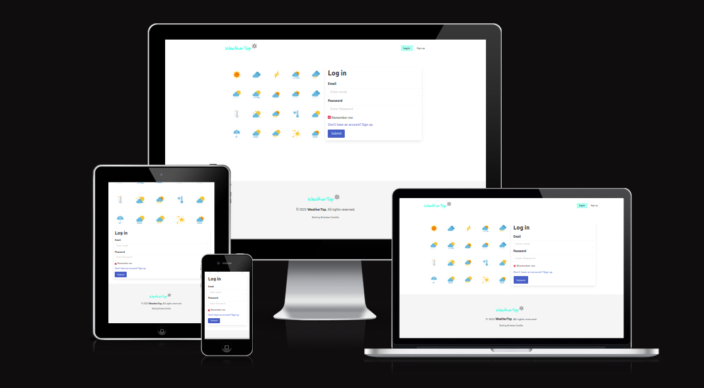
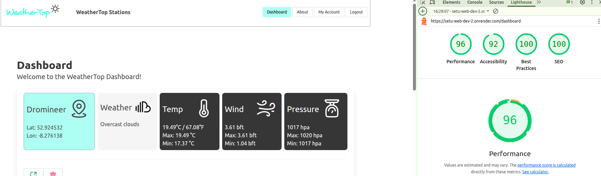
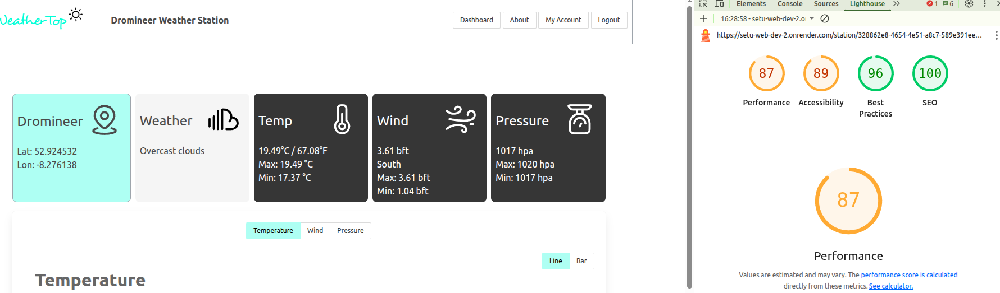
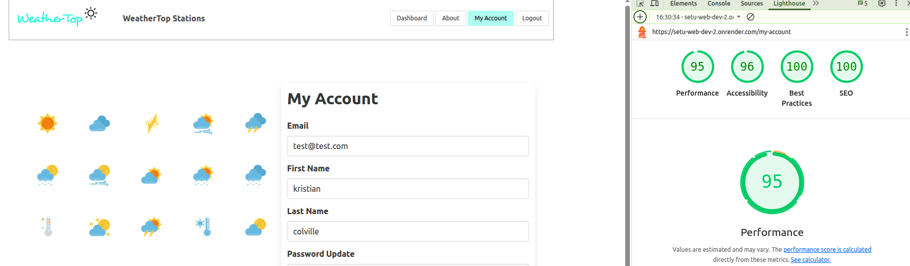

# WeatherTop

Developer: Kristian Colville

Site credentials:
username:test@test.com
password: password



[Visit WeatherTop](https://setu-web-dev-2.onrender.com/)

## Table of Contents

* [Project Goals](#project-goals)
  * [Personal Goals](#personal-goals)
* [User Experience (UX)](#user-experience-ux)
  * [Target Audience](#target-audience)
* [Design](#design)
  * [Color Scheme](#color-scheme)
  * [Typography](#typography)
  * [Layout](#layout)
  * [Icons](#icons)
  * [Leveraging Bulma](#leveraging-bulma)
* [Technologies &amp; Tools](#technologies--tools)
* [Features](#features)
  * [Baseline](#baseline)
  * [Release 1](#release-1)
  * [Release 2](#release-2)
  * [Release 3](#release-3)
  * [Release 4](#release-4)
* [Data](#data)
* [Testing](#testing)
  * [Google Lighthouse Results](#google-lighthouse-results)
* [Bugs](#bugs)
  * [Bug Details](#bug-details)
* [Releases](#releases)
  * [Overview](#overview)
  * [Git Workflow](#git-workflow)
  * [Development Strategy](#development-strategy)
    * [Timeline](#timeline)
    * [Git Scope & Branching](#git-scope--branching)
  * [Release Results](#release-results)
    * [Baseline](#baseline-1)
    * [Release 1](#release-1-1)
    * [Release 2](#release-2-1)
    * [Release 3](#release-3-1)
* [Development &amp; Deployment](#development--deployment)
  * [Version Control](#version-control)
  * [Cloning the Repository](#cloning-this-repository)
  * [Render](#render)
* [Credits](#credits)


## Project Goals

WeatherTop is building a next-generation web platform that lets users create their own weather stations and effortlessly log atmospheric data. The application will:

- **Deliver a modern, responsive UI** that looks great on any device, leveraging Bulma CSS for layout, typography, and minimal custom styling.
- **Pull real-time conditions from the OpenWeather API** for accurate, up-to-the-minute data, seamlessly integrating external data sources.
- **Visualise observations through intuitive dashboards and charts** so insights are easy to grasp, using dynamic graphs and data visualizations for temperature, wind, and pressure trends.
- **Prioritise accessibility and performance**, ensuring a fast, user-friendly experience with responsive design, mobile-friendly navigation, and minimal load times.
- **Enable secure, personalized user experiences** by supporting member sign-up, login, and user-specific weather stations, with robust password hashing and authentication.
- **Empower users with data management tools** such as adding, editing, and deleting stations and reports, with features like cascade deletion and profile editing.
- **Provide advanced features** including interactive maps for station location, auto-filling coordinates, and feedback mechanisms for login and error handling.
- **Maintain a clean, maintainable codebase** using a clear MVC architecture, Express.js with Handlebars templating, and a structured Git workflow for iterative development and deployment.

By combining rich API data, thoughtful design, and robust engineering practices, this project aims to turn raw weather numbers into clear, actionable insights for everyone, while remaining easy to extend and maintain.


### Personal Goals

As the developer of this project, I was hired by Weather Top to design and build their first official web application. My personal goals for this project include:

- **Building a weather station reporting application from the ground up**, establishing a solid foundation for future growth.
- **Applying best practices in frontend development and UI/UX design**, focusing on accessibility, responsiveness, and a polished user experience with Bulma CSS and minimal custom code.
- **Working with APIs to dynamically fetch, process, and display weather data**, integrating real-time external data and visualizing it through charts and dashboards.
- **Utilising compute resources to dynamically render templates**, ensuring efficient server-side rendering with Express.js and Handlebars.
- **Implementing secure authentication and data protection**, including password salting, hashing, and proper session management.
- **Designing and following a structured Git workflow**, using feature branches, clear commit messages, and continuous deployment via Render.
- **Testing and debugging throughout development**, using tools like Google Lighthouse and addressing bugs as they arise to ensure a robust, high-quality product.
- **Documenting the development process and decisions**, providing clear instructions for setup, deployment, and future contributions.

These goals guided my approach to delivering a feature-rich, secure, and user-friendly weather platform that meets both user needs and modern web development standards.


## User Experience (UX)
### Target Audience

WeatherTop is designed for a broad range of users who are interested in monitoring, recording, and analyzing weather station data. The primary target audiences include:

- **Amateur Weather Enthusiasts:** Individuals who enjoy tracking local weather conditions, maintaining personal weather stations, and sharing observations.
- **Students & Educators:** Learners and teachers in science, geography, or environmental studies who need a practical, interactive tool for logging and visualizing atmospheric data.
- **Community Groups & Clubs:** Local clubs, schools, or organizations that want to collaboratively monitor weather trends in their area.
- **Tech-Savvy Users:** Developers or hobbyists interested in experimenting with APIs, data visualization, and web technologies in a real-world context.
- **Mobile Users:** People who need quick, responsive access to weather data on-the-go, whether in the field or at home.

The platform is built to be accessible and user-friendly for both beginners and advanced users, with a focus on clear data presentation, ease of use, and secure, personalized experiences.


## Design
### Color Scheme

WeatherTop uses Bulma’s color palette to ensure a consistent, accessible, and professional look throughout the app. Key color choices include:

- **Primary highlights:** `is-primary` and `is-info` for important areas.
- **Active states:** `is-active` and modified `is-primary` for interactive elements.
- **Alerts:** Subtle use of `is-danger` for login feedback and buttons.
- **Navigation:** A white navigation bar (`has-background-white`) for a clean header.
- **Backgrounds:** A soft off-white main body background to reduce eye strain.
- **Footer:** Light grey footer to visually separate the bottom section.

These choices create a visually distinct, easy-to-navigate interface that remains accessible and user-friendly.


### Typography

Desyrel for the logo font. Everything else in built by bulma.

Bulma’s default sans-serif stack gives the app a clean, modern voice without extra downloads—ideal when users are loading live data out in the field.

#### In-Depth Typography Approach

- **Logo Font:** The WeatherTop logo uses the [Desyrel font](https://online-fonts.com/fonts/desyrel), chosen for its distinctive, friendly style that helps establish brand identity and visual interest at the top of each page.
- **Body & UI Text:** All other text elements use Bulma’s default font stack:  
  `BlinkMacSystemFont, -apple-system, "Segoe UI", "Roboto", "Helvetica Neue", Arial, sans-serif`.  
  This stack ensures fast loading, consistent rendering, and optimal readability across all platforms and devices.
- **Bulma Type Helpers:**  
  - `.title` and `.subtitle` classes are used for headings, ensuring a clear hierarchy and visual separation between sections.
  - `.content` is applied to paragraphs and lists, providing comfortable line spacing and font sizing for longer text blocks.
  - Responsive sizing is achieved by using Bulma’s modifiers to scale headings appropriately on different devices.
- **Accessibility:**  
  - Sufficient contrast is maintained between text and background colors, leveraging Bulma’s palette.
  - Font sizes and weights are chosen to meet accessibility guidelines, ensuring legibility for all users.
- **Minimal Custom CSS:**  
  - The project intentionally avoids custom fonts (except for the logo) and heavy overrides, reducing load times and maintenance.
  - Any additional styling is limited to minor tweaks for alignment or emphasis, keeping the codebase clean.

This approach ensures that typography across WeatherTop is visually appealing, accessible, and consistent, while also being performant and easy to maintain.


### Layout

Every WeatherTop page sits on **Bulma’s column and container grid**. This framework lets us:

- Slot weather cards, station details, and forecast charts neatly into place  
- Re-flow the layout from widescreen dashboards to pocket-sized views without fuss  
- Use spacing helpers for breathing room, sparing us from one-off CSS tweaks

The result is a layout that feels natural whether you’re tracking a storm on a laptop or checking temperatures from your phone.

### Icons

| Logo                                                  | Description           |
|-------------------------------------------------------|-----------------------|
|  | Clear sky             |
|  | Few clouds            |
|  | Scattered clouds      |
|  | Broken clouds         |
|  | Shower rain           |
|  | Rain                  |
|  | Thunderstorm          |
|  | Snow                  |
|  | Mist                  |


### Leveraging Bulma

Our UI/UX approach aimed to **minimize custom CSS** from the start. By leaning on Bulma’s handy spacing, alignment, and component helpers, we managed to:

- **Trim development time by about 20 %** (by my estimate)  
- **Maintain consistent visual patterns** across the interface  
- **Simplify upkeep and future tweaks**

We only added bespoke styles when Bulma couldn’t cover a specific need, keeping the stylesheet lean and tidy. The result is a responsive, polished interface that serves users well and stays friendly for developers to extend.


## Technologies &amp; Tools

- [HTML](https://developer.mozilla.org/en-US/docs/Web/HTML) - The standard markup language used to structure the web pages and content of the application.
- [CSS3](https://developer.mozilla.org/en-US/docs/Web/CSS ) - Used for styling the application, enhancing layout, colors, and responsiveness.
- [JavaScript](https://developer.mozilla.org/en-US/docs/Web/JavaScript) - The primary programming language powering the web app’s interactivity.
- [Bulma CSS Framework](https://bulma.io/) - A modern, responsive CSS framework used for layout, typography, and UI components to minimize custom styling.
- [Flaticon](https://www.flaticon.com/) - Source for the weather icons used in the app, providing clear and attractive visuals for weather conditions.
- [Favicon](https://favicon.io/) - A favicon generator for the web app.
- [GeeksForGeeks](https://www.geeksforgeeks.org/node-js/node-js-crypto-pbkdf2-method/) - Referenced for working with NodeJs and building a salt & hashing password system
- [Photopea](https://www.photopea.com/) - An online photo editing tool used to customize the logo for the project.
- [Render](https://render.com/) - For deploying my project and using compute resources.
- [Frappe](https://frappe.io/charts/docs) - For the project charts.
- [LeafletJs](https://leafletjs.com/examples/quick-start/) - For map functionality to show stations on world map.
## Features
### Baseline

Features:
- Add and list stations
- Click on a station to open its detail page (shows station name)
- Includes a `station-controller.js`

### Release 1

Features:
- Add a report to a station with the specified parameters in the “Report” column
- Each station can have multiple reports (reports have a `stationId`)
- Includes a `report-controller.js`

### Release 2

Features:
- Dropdown for wind directions displayed in an easy to read format for manual entry
- Dynamically rendered icon for weather code
- Members can sign up and log in
- Members can create any number of weather stations (stations have a `userId`)
- Includes an `accounts-controller.js`
- Only shows stations belonging to the logged-in member

### Release 3

Features:
- Time and date saved of the report generated
- User can edit their personal details in the 'My Account' section
- Member dashboard lists latest conditions for all stations alphabetically (using the time in the “Report” column)
- Members can delete reports or stations
- Deleting a station automatically deletes its reports (cascade delete)

### Release 4

Features:
- Simple graph of trends
- Temperature Graph
- Wind Direction Graph
- Pressure Graph
- Line and bar charts
- Password salting and hashing for security
- Login feedback, tells the user if account details are incorrect logging in
- Map showing locations of the stations user has selected
- Clicking on an area in the map auto fills the latitude and longitude for quick add of stations
- Responsive Design, a hamburger menu added to show options on mobile screens

## Data

## Testing
### Google Lighthouse Results

Dashboard


Station View


My Account View


## Bugs


| ID  |    Issue                        |                 Description             |         Solution                  |   Release Fixed    |
| --- | ------------------------------- | --------------------------------------- | --------------------------------- | ------------------ |
| 1   | Ajax Request for Authentication | Authenticate API not getting form data  | Added middleware for parsing JSON | Release 4          |
| 2   | Password Protection             | Users logging in could use any password | Refactored and added encryption   | Release 4          |

### Bug Details

Bug #1: When upgrading the login portal feature in release 4 the authenticate API was not getting the data correctly. Checked the frontend and it was definitely being sent. After researching I discovered the issue was on the NodeJs side, specifically the middleware in the express application. Added the middleware and feature was fixed.

Bug #2: Password protection on the login portal was not implemented correctly to verify the users password. Any user could login with someones email address. I created utility to encrypt using salt and hashing, this made the application more secure and with proper authentication system.

## Releases
### Overview

This repository documents the iterative development of the WeatherTop website assignment.

Development follows a structured, branch-based workflow, progressing from initial Proof-of-Concepts (POCs) to full Releases. Each phase is tracked with dedicated branches and clear, incremental commits.

### Git Workflow

Typical commands for managing branches:

```bash
git checkout -b branch_name
git push --set-upstream origin branch_name
git checkout main
git pull origin branch_name
git push origin main
```

### Development Strategy

The assignment is delivered in multiple iterations:

- **Baseline**
- **Release 1** → **Release 3**
- **Release 4** and beyond (if time permits)

Key practices:

- Initialize with a robust project foundation.
- Create a new branch for each POC and Release, following assignment guidelines.
- Build each stage on the previous, ensuring commits are focused and meaningful.
- Use **Express.js** with **Handlebars** for templating, **Bulma** for styling, and a clear **MVC architecture** in JavaScript.
- Host the Node.js app on **Render**.

---

#### Timeline

| Milestone                 | Date                 |
| ------------------------- | -------------------- |
| Project Start             | June 12th, 2025      |
| Expected Final Submission | August 24th, 2025    |
| Approximate Duration      | 15 weeks             |

---

#### Git Scope & Branching

| Branch       | Description                   |
| ------------ | ----------------------------- |
| `main`       | Stable, release-ready version |
|              |                               |
| `baseline`   | Baseline project              |
| `rel1`       | Release 1                     |
| `rel2`       | Release 2                     |
| `rel3`       | Release 3                     |


### Release Results

Each release in this project followed the branching and feature plan outlined above. Here’s a summary of what was achieved at each stage:

#### Baseline

Established the core structure of the application, including the ability to add and list stations, and view station details. This provided the foundation for all subsequent development.

#### Release 1

Expanded functionality to support adding multiple reports per station, with each report linked to its station. Introduced the report controller and enabled richer data entry for weather observations.

#### Release 2

Focused on user management and improved data entry. Added member authentication, user-specific stations, and enhanced UI elements such as dropdowns and dynamic icons. Ensured that only logged-in users could manage their own stations and reports.

#### Release 3

Enhanced user experience and data management. Implemented time-stamping for reports, user profile editing, and improved dashboard sorting. Added cascade deletion for stations and their reports, and enabled users to manage their data more effectively.

#### Release 4

Delivered advanced features and polish. Introduced data visualization with graphs, improved security with password hashing and login feedback, and added mapping functionality for station locations. Finalized responsive design with a mobile-friendly navigation menu.

> For a detailed breakdown of features per release, see the [Features](#features) section above.


## Development & Deployment

### Version Control

I used [Visual Studio Code](https://code.visualstudio.com/) as a local repository and IDE & [GitHub](https://github.com/) as a remote repository.

1. Firstly, I needed to create a new repository on Github [setu-web-dev-2](https://github.com/KristianColville1/setu-web-dev-2).
2. I opened that repository on my local machine by copying the URL from that repository and cloning it from my IDE for use.
3. Visual Studio Code opened a new workspace for me.
4. I created files and folders to use.
5. To push my newly created files to GitHub I used the terminal by pressing Ctrl + shift + `.
6. A new terminal opened and then I used the below steps.

   - `git add (name of the file)` *This selects the file for the commit*
   - `git commit -m "Commit message: (i.e. Initial commit)"` *Allows the developer to assign a specific concise statement to the commit*
   - `git push` *The final command sends the code to GitHub*

### Cloning this Repository

If you would like to clone this repository please follow the bellow steps.

Instructions:

1. Log into GitHub.
2. Go to the repository you wish to clone.
3. Click the green "Code" button.
4. Copy the URL provided under the HTTPS option.
5. Open your preferred IDE with Git installed.
6. Open a new terminal window in your IDE.
7. Enter the following command exactly: `git clone the-URL-you-copied-from-GitHub`.
8. Press Enter.

### Render

I used [Render](https://render.com/) for deploying my project.

1. First, I created an account on [Render](https://render.com/).
2. I connected my GitHub repository to Render by clicking the "New Web Service" button on the Render dashboard.
3. I selected "Web Service" and authorized Render to access my GitHub account.
4. I chose the repository I wanted to deploy from the list of available options.
5. I specified the start command (e.g. `node app.js` or your main server file).
6. I set the appropriate environment variables if required (such as `PORT`).
7. After confirming the settings, I clicked "Create Web Service."
8. Render then started building and deploying the project, and once finished, it provided a URL for accessing the live site.

Render also automatically sets up continuous deployment. Any new changes pushed to the main repository will trigger a new deployment on Render.


## Credits
- [GeeksForGeeks](https://www.geeksforgeeks.org/node-js/node-js-crypto-pbkdf2-method) - Helped salting and hashing passwords
- [SETU](https://www.setu.ie/) - Glitch template used for the base of NodeJs project, setting up express and basic structure.
- [StackOverflow](https://stackoverflow.com/questions/10005939/how-do-i-consume-the-json-post-data-in-an-express-application) - Helped figuring out middleware was needed to parse a json request for the login portal